# run-all-now

Drop-in `npm-run-all` replacement powered by Rust with zero runtime dependencies.

`run-all-now` keeps the familiar `npm-run-all`, `run-s`, and `run-p` commands from [`npm-run-all`](https://www.npmjs.com/package/npm-run-all). It moves orchestration into a native Rust binary and keeps the npm package dependency-free.

Original package links: [`npm-run-all` on npm](https://www.npmjs.com/package/npm-run-all), [`mysticatea/npm-run-all` on GitHub](https://github.com/mysticatea/npm-run-all).

## Why switch?

| You get | What changes |
| --- | --- |
| Zero runtime dependencies | Remove `npm-run-all`'s 9 direct runtime dependencies. |
| Smaller installs | 17.6 MB `node_modules` footprint becomes 552 KiB in the local fixture. |
| Faster orchestration | 201 ms becomes 150 ms average in the local no-op benchmark. |
| Rust core | Scheduling, matching, output handling, and process control run in native code. |
| Drop-in API | Keep `npm-run-all`, `run-s`, `run-p`, and `require("run-all-now")`. |
| Multi-platform support | macOS, Linux, and Windows on x64/arm64. |

## Install

```bash
npm install --save-dev run-all-now
```

Replace the package, not your scripts:

```diff
- npm install --save-dev npm-run-all
+ npm install --save-dev run-all-now
```

```json
{
  "scripts": {
    "build": "run-s clean build:*",
    "dev": "run-p watch:*",
    "ci": "npm-run-all --silent lint test build"
  }
}
```

## CLI

```bash
run-s clean lint build
run-p --max-parallel 4 "watch:* -- --color"
npm-run-all clean --parallel "build:* -- --watch" --sequential test
```

Supported compatibility flags:

- `-c`, `--continue-on-error`
- `-l`, `--print-label`
- `-n`, `--print-name`
- `-p`, `--parallel`
- `-s`, `--sequential`, `--serial`, `--silent` in `run-s` / `run-p`
- `-r`, `--race`
- `--aggregate-output`
- `--max-parallel <number>`
- `--npm-path <path>`
- `--` argument forwarding and `{1}`, `{@}`, `{*}`, `{n:-default}`, `{n:=default}` placeholders

## Node API

```js
const runAll = require("run-all-now");

await runAll(["clean", "lint", "build:*"], {
  parallel: false,
  stdout: process.stdout,
  stderr: process.stderr
});

await runAll(["watch:* -- --color"], {
  parallel: true,
  maxParallel: 4,
  printLabel: true
});
```

Resolved values match `npm-run-all`:

```js
[
  { name: "clean", code: 0 },
  { name: "lint", code: 0 }
]
```

Failures reject with `NpmRunAllError` and include `error.results`.

## Compatibility

`run-all-now` runs tasks through npm or yarn. It does not reimplement package-manager script semantics. This keeps environment setup, lifecycle behavior, and script argument forwarding compatible with existing projects.

Glob-like script patterns use `:` as the separator:

```bash
run-s build:*
run-p watch:**
```

## Comparison snapshot

Local fixture from `scripts/benchmark.js` on `darwin-arm64` with `run-s --silent noop:0`:

| Metric | npm-run-all | run-all-now |
| --- | ---: | ---: |
| Average runtime | 201 ms | 150 ms |
| Direct runtime deps | 9 | 0 |
| Installed package roots | 134 | 2 |
| node_modules size | 17.6 MB | 552 KiB |
| Root package tarball | 18.6 KB | 6.5 KB |
| Platform tarball | n/a | 246.7 KB |
| Peak memory footprint | 24.4 MB | 13.3 MB |
| Max RSS | 73.1 MB | 73.0 MB |

The main package is small. One optional native package installs for your OS and CPU.

### Dependencies

`run-all-now` removes all direct runtime dependencies from the orchestration package.


### Size

The installed `node_modules` footprint is **32.6x smaller** in the local fixture.

```mermaid
%%{init: {"theme": "dark", "themeVariables": {"xyChart": {"plotColorPalette": "#fb7185,#22c55e"}}}}%%
xychart-beta
  title "Installed size: 32.6x smaller"
  x-axis ["node_modules MB"]
  y-axis "MB" 0 --> 18
  bar [17.6]
  bar [0.54]
```



### Speed

The published npm path is **1.34x faster** in the local no-op benchmark.

```mermaid
%%{init: {"theme": "dark", "themeVariables": {"xyChart": {"plotColorPalette": "#fb7185,#22c55e"}}}}%%
xychart-beta
  title "Speed: 1.34x faster"
  x-axis ["average runtime ms"]
  y-axis "ms" 0 --> 220
  bar [201]
  bar [150]
```



In each chart, the first bar is `npm-run-all` and the second green bar is `run-all-now`.

## Package architecture

```text
run-all-now              # JS bins + CommonJS API bridge, zero third-party deps
@run-all-now/darwin-arm64
@run-all-now/darwin-x64
@run-all-now/linux-arm64
@run-all-now/linux-x64
@run-all-now/win32-arm64
@run-all-now/win32-x64   # optional native Rust binary packages
```

The main package exposes tiny JavaScript bins for npm portability. They resolve the matching optional platform package, then execute the Rust binary with `RUN_ALL_NOW_BIN_NAME` set to preserve `run-s`, `run-p`, and `npm-run-all` behavior.

The CommonJS API uses the same binary resolver. If `RUN_ALL_NOW_BINARY` is set, the API bridge uses that binary. During development, it falls back to `target/release/run-all-now` or `target/debug/run-all-now`.

## Development

```bash
cargo fmt --check
cargo clippy --all-targets -- -D warnings
npm test
npm run pack:check
```

The Rust crate has no external crates. The npm package has no third-party runtime dependencies.

## License

MIT
