```mermaid
%%{init: {"theme": "dark", "themeVariables": {"xyChart": {"plotColorPalette": "#fb7185,#22c55e"}}}}%%
xychart-beta
  title "Installed size: 32.6x smaller"
  x-axis ["node_modules MB"]
  y-axis "MB" 0 --> 18
  bar [17.6]
  bar [0.54]
```

# run-all-now

Run npm scripts in sequence or parallel without `npm-run-all`'s dependency tree.

`run-all-now` is an API-compatible replacement for [`npm-run-all`](https://www.npmjs.com/package/npm-run-all). It keeps the familiar `npm-run-all`, `run-s`, and `run-p` commands, supports CommonJS and ESM, and uses one native Rust binary for orchestration.

Original package links: [`npm-run-all` on npm](https://www.npmjs.com/package/npm-run-all), [`mysticatea/npm-run-all` on GitHub](https://github.com/mysticatea/npm-run-all).

## Install

```sh
npm i -D run-all-now
```

Node.js 18+ is required for the package API and launchers.

The package does not run `preinstall`, `install`, or `postinstall` scripts. The JavaScript launchers select the matching optional native package at runtime. If the native binary is missing for your platform, `run-all-now` fails loudly instead of silently falling back to slower shell tooling.

Replace the package, not your scripts:

```diff
- npm i -D npm-run-all
+ npm i -D run-all-now
```

```json
{
  "scripts": {
    "build": "run-s clean build:*",
    "dev": "run-p watch:*",
    "ci": "npm-run-all --silent lint test build"
  }
}
```

## CLI

```sh
run-s clean lint build
run-p --max-parallel 4 "watch:* -- --color"
npm-run-all clean --parallel "build:* -- --watch" --sequential test
```

`run-s` runs scripts sequentially. `run-p` runs scripts in parallel. `npm-run-all` supports mixed sequential and parallel groups.

Supported compatibility flags:

- `-c`, `--continue-on-error`
- `-l`, `--print-label`
- `-n`, `--print-name`
- `-p`, `--parallel`
- `-s`, `--sequential`, `--serial`, `--silent` in `run-s` / `run-p`
- `-r`, `--race`
- `--aggregate-output`
- `--max-parallel <number>`
- `--npm-path <path>`
- `--` argument forwarding and `{1}`, `{@}`, `{*}`, `{n:-default}`, `{n:=default}` placeholders

Glob-like script patterns use `:` as the separator:

```sh
run-s build:*
run-p watch:**
```

## Node API

CommonJS:

```js
const runAll = require('run-all-now')
```

ESM:

```js
import runAll from 'run-all-now'
```

Use the same function in both module systems:

```js
await runAll(['clean', 'lint', 'build:*'], {
  parallel: false,
  stdout: process.stdout,
  stderr: process.stderr
})

await runAll(['watch:* -- --color'], {
  parallel: true,
  maxParallel: 4,
  printLabel: true
})
```

Resolved values match `npm-run-all`:

```js
[
  { name: 'clean', code: 0 },
  { name: 'lint', code: 0 }
]
```

Failures reject with `NpmRunAllError` and include `error.results`.

## Compatibility

`run-all-now` runs tasks through npm or yarn. It does not reimplement package-manager script semantics. This keeps environment setup, lifecycle behavior, and script argument forwarding compatible with existing projects.

Native packages are available for macOS, Linux, and Windows on x64/arm64.

## Benchmark

Local `darwin-arm64` snapshot. Runtime uses `npm run benchmark` with `run-s --silent noop:0`. Lower is better.

| Metric | `npm-run-all` | `run-all-now` | Improvement |
| --- | ---: | ---: | ---: |
| Direct runtime deps | `9` | `0` | `9 fewer` |
| `node_modules` size | `17.6 MB` | `552 KiB` | `32.6x smaller` |
| Average runtime | `201 ms` | `150 ms` | `1.34x faster` |
| Peak memory footprint | `24.4 MB` | `13.3 MB` | `1.83x smaller` |

```mermaid
%%{init: {"theme": "dark", "themeVariables": {"xyChart": {"plotColorPalette": "#fb7185,#22c55e"}}}}%%
xychart-beta
  title "Dependencies: 9 fewer direct runtime deps"
  x-axis ["direct runtime deps"]
  y-axis "count" 0 --> 10
  bar [9]
  bar [0]
```







```mermaid
%%{init: {"theme": "dark", "themeVariables": {"xyChart": {"plotColorPalette": "#fb7185,#22c55e"}}}}%%
xychart-beta
  title "Speed: 1.34x faster"
  x-axis ["average runtime ms"]
  y-axis "ms" 0 --> 220
  bar [201]
  bar [150]
```

In each chart, the first bar is `npm-run-all` and the second green bar is `run-all-now`.

Run the benchmark locally:

```sh
npm run build
npm run benchmark
```

## Development

```sh
cargo fmt --check
cargo clippy --all-targets -- -D warnings
npm test
npm run pack:check
```

## License

MIT
